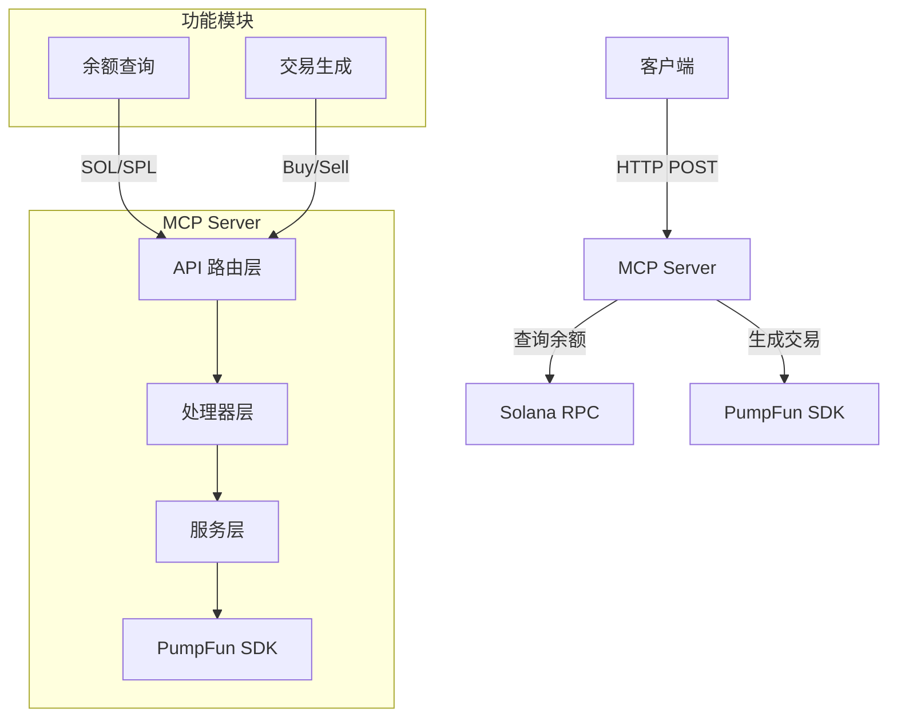

# PumpFun MCP Server

PumpFun MCP (Model Context Provider) Server 是一个基于大模型的上下文处理服务，用于处理和生成 PumpFun 协议相关的交易和查询请求。它作为智能中间层，能够理解用户意图并转换为相应的链上操作。

## 架构概览



## 主要功能

1. **余额查询**

    - `/balance/sol`: 查询 SOL 余额
    - `/balance/spl`: 查询 SPL 代币余额

2. **交易生成**
    - `/pumpfun/buy`: 生成购买代币交易
    - `/pumpfun/sell`: 生成出售代币交易

## 技术栈

-   Runtime: Bun
-   Framework: Express
-   Blockchain: Solana
-   SDK: PumpFun SDK

## 安装依赖

```bash
bun install
```

## 运行服务

```bash
bun run index.ts
```

## API 文档

### 查询 SOL 余额

```typescript
POST /balance/sol
{
    "type": "balance/sol",
    "payload": {
        "userAddress": "Solana地址"
    }
}
```

### 查询 SPL 代币余额

```typescript
POST /balance/spl
{
    "type": "balance/spl",
    "payload": {
        "userAddress": "Solana地址",
        "mint": "代币Mint地址"
    }
}
```

### 生成购买交易

```typescript
POST /pumpfun/buy
{
    "type": "pumpfun/buy",
    "payload": {
        "userAddress": "买方地址",
        "mint": "代币Mint地址",
        "buyAmountHumanReadableSol": 数量
    }
}
```

### 生成出售交易

```typescript
POST /pumpfun/sell
{
    "type": "pumpfun/sell",
    "payload": {
        "userAddress": "卖方地址",
        "mint": "代币Mint地址",
        "sellAmountHumanReadableToken": 数量,
        "slippage": 滑点百分比
    }
}
```

This project was created using `bun init` in bun v1.2.15. [Bun](https://bun.sh) is a fast all-in-one JavaScript runtime.
